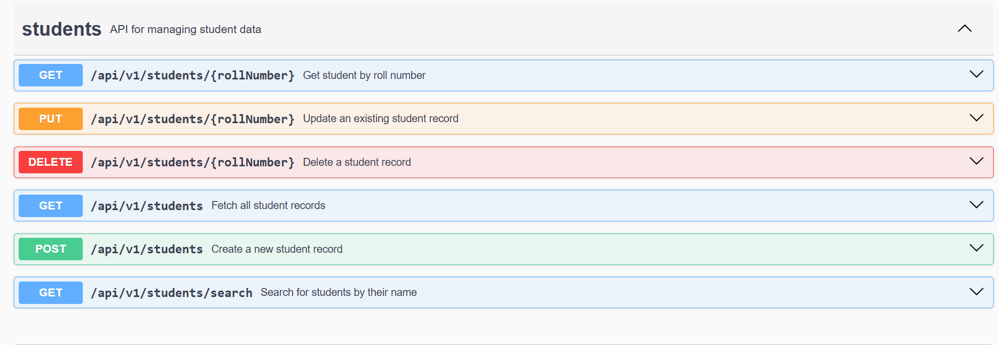
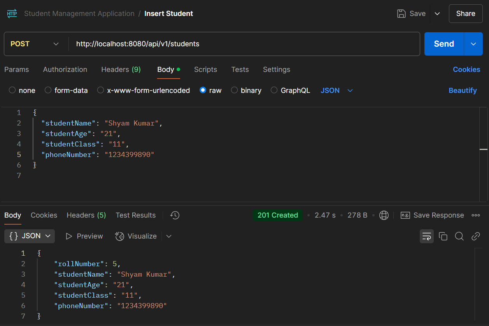

# Student Management System

## 📌 Overview
This is a **Spring Boot** project for managing student records. It provides REST APIs for adding, updating, deleting, and retrieving student information.

## 🚀 Technologies Used
- **Spring Boot** (Backend)
- **Spring Data JPA** (Database Handling)
- **MySQL** (Relational Database)
- **Gradle** (Build Tool)
- **Lombok** (Simplifies Java Code)
- **Swagger & OpenAPI** (API Documentation)

## ⚙️ Prerequisites

Before getting started, ensure you have the following installed:

- **Java 8 or later** 
- **MySQL** 
- **Gradle** 

Also, make sure that your MySQL database is up and running.

## 🛠 Project Setup
### 1️⃣ Clone the Repository
```sh
git clone [<repository-url>](https://github.com/951-Shobhit-Kumar/Student_Management.git)
cd StudentManagement
```

### 2️⃣ Build the Project
```sh
gradlew clean build
```

### 3️⃣ Run the Application
```sh
gradlew bootRun
```
The application will start at `http://localhost:8080`

## 📂 Project Structure
```
StudentManagement/
├── src/main/java/com/StudentManagement/Student/
│   ├── StudentController/    # REST Controllers
│   ├── StudentServices/      # Business Logic
│   ├── StudentRepository/    # Database Access Layer
│   ├── StudentModel/         # Entity Classes
│   ├── HandlingException/    # Global Exception Handling
│   ├── Utility/              # Utility Classes
│   └── StudentApplication.java  # Main Application
├── src/main/resources/
│   ├── application.properties  # Configurations
│   ├── OpenApi/                 # API Documentation
│   ├── static/                  # Static Resources
│   ├── templates/               # HTML Templates
│   └── student_api_description.yaml  # OpenAPI Spec
├── src/test/java/com/StudentManagement/Student/
│   ├── StudentApplicationTests/  
│   ├── StudentControllerTests/   # Controller Tests
│   └── StudentServiceTests/      # Service Tests
├── build.gradle  # Gradle Build File
└── README.md  # Project Documentation
```

## 🔗 API Endpoints
This project follows an **API-first approach**, where the API documentation was created first and the endpoints were generated using **Swagger & OpenAPI**.

| Method | Endpoint | Description |
|--------|------------|-------------|
| **POST**   | `/api/v1/students` | Create a new student record |
| **GET**    | `/api/v1/students` | Fetch all student records |
| **GET**    | `/api/v1/students/{rollNumber}` | Get student by roll number |
| **GET**    | `/api/v1/students/search?name={name}` | Search students by name |
| **PUT**    | `/api/v1/students/{rollNumber}` | Update student details |
| **DELETE** | `/api/v1/students/{rollNumber}` | Delete a student |

## 🛠 Features Implemented
- **Followed API-First Approach**: First created API documentation and then generated endpoints using **Swagger & OpenAPI**.
- **Global Exception Handling**: Ensures consistent error responses across the application.
- **Modular & Clean Coding Standards**: The project is structured to maintain readability and maintainability.
- **Test Cases**: Added unit tests for **Controller** and **Service** classes to ensure reliability.

## 🎨 Design Patterns Used
In this project, I've leveraged some classic design patterns to improve code structure, maintainability, and scalability. Here's a breakdown of the ones that come into play:

1. **Controller-Service-Repository Pattern (Layered Architecture)**
    - **What it is:** A common architectural pattern that divides the application into three main layers: the Controller (handles incoming requests), the Service (contains the business logic), and the Repository (manages data access).
    - **Why I used it:** This helps keep the code organized, improves readability, and makes it much easier to manage and scale the application as it grows.

2. **Singleton Pattern**
    - **What it is:** The Singleton pattern ensures that only one instance of a class exists throughout the application's lifecycle.
    - **Why I used it:** Spring Boot automatically applies the Singleton pattern to beans, such as `StudentService` and `StudentRepository`, so they’re created only once and shared throughout the application. This saves memory and boosts performance.

3. **Dependency Injection (DI) / Inversion of Control (IoC)**
    - **What it is:** DI is a core principle of Spring. It allows Spring to manage the creation and injection of dependencies (like services and repositories) into your components, instead of having to create them manually.
    - **Why I used it:** This makes the application more flexible and testable. It also decouples components, so each piece of the system focuses only on its own responsibility.

4. **DTO (Data Transfer Object) Pattern** (Optional)
    - **What it is:** The DTO pattern separates the internal data model from the data being sent over the network or between layers.
    - **Why I used it:** While not explicitly implemented yet, using DTOs can be useful for controlling what data gets exposed to external users and also to decouple your internal model from external communication.

5. **Builder Pattern** (Optional)
    - **What it is:** The Builder pattern is used for constructing complex objects with many attributes in a readable, step-by-step way.
    - **Why I used it:** If you decide to add more complexity to `Student` creation in the future, the **Lombok `@Builder` annotation** would be a great way to apply this pattern, making object construction much easier and cleaner.

6. **Exception Handling Pattern**
    - **What it is:** A pattern that ensures errors are handled consistently and appropriately throughout the application.
    - **Why I used it:** In this project, the global exception handling mechanism ensures that all exceptions are caught and handled in a standardized way. This gives users clear, meaningful error messages and makes it easier to manage errors across the application.

## application.properties Example 
spring.application.name=Student

## Database properties (use environment variables for sensitive data)
 - spring.datasource.url=jdbc:mysql://localhost:3306/student_db
 - spring.datasource.username=${DB_USERNAME}  # Set environment variable for username
 - spring.datasource.password=${DB_PASSWORD}  # Set environment variable for password
 - spring.datasource.driver-class-name=com.mysql.cj.jdbc.Driver
# JPA and Hibernate properties
 - spring.jpa.show-sql=true
 - spring.jpa.hibernate.ddl-auto=update

## 🧪 Running Tests

This project includes unit and integration tests to ensure the reliability of the application. The tests cover various components like the controller and service layers, making sure everything works as expected.

### Student Management System - Testing Strategy

## Overview
Automated tests cover **Controller** and **Service** layers using **JUnit**, **Mockito**, and **MockMvc**.

## Test Coverage
- **Controller**: Tests for CRUD operations (create, read, update, delete), handling valid and invalid requests, and status codes (200, 201, 204, 404).
- **Service**: Verifies student addition, retrieval, update, deletion, and searching by name with proper exception handling for missing or invalid data.

## Key Features
- **CRUD**: Create, Read, Update, Delete.
- **Exception Handling**: Invalid data, missing resources, duplicates.

## Future Enhancements
- **Pagination**: For large datasets.
- **Caching**: Redis for frequently accessed data.

## Running Tests
```bash
./gradlew test
````
```bash
gradlew test
```
# Swagger UI Integration

### View Swagger UI
To view Swagger UI, run the application and open the following URL in your browser:

http://localhost:8080/swagger-ui/
### Swagger UI Screenshot
Below is the screenshot of the Swagger UI for the Student Management System:



## Postman Testing

The following images provide an overview of the Postman testing conducted for the project:

1. ![GET_ALL_STUDENT]
   - This image shows the setup and execution of the GET_ALL_STUDENT test case, which retrieves all student records when hitting the API.
2. ![FIND_STUDENT_BY_NAME]
   - This image highlights the setup and execution of the FIND_STUDENT_BY_NAME test case, which retrieves a student record by name.
3. 
   - This image demonstrates the setup and execution of the INSERT_STUDENT test case, which inserts a new student record into the database.
4. ![DELETE_STUDENT](Assests/inserting_student.png)
   - This image demonstrates the setup and execution of the DELETE_STUDENT test case, which deletes a  student record from the database.


## 🚀 Future Enhancements

### 1️⃣ Caching with Redis
   - Add Redis caching to improve performance for frequently accessed student data. This will reduce database load and speed up response times.

### 2️⃣ Pagination for Fetching Students
   - Implement pagination for the `/api/v1/students` endpoint to fetch student records in smaller chunks, improving efficiency when the dataset grows.

---
**Author:** Shobhit Kumar

